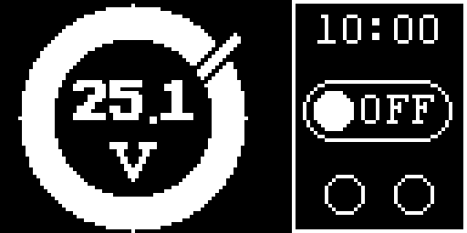
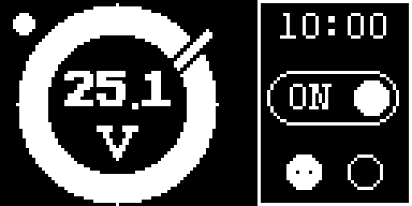
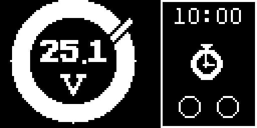
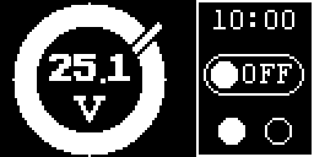
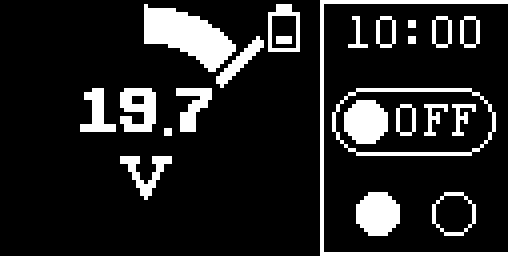
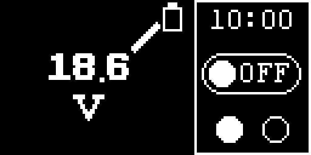
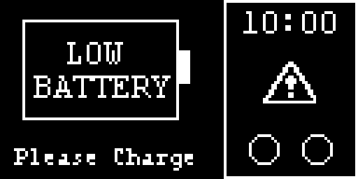

# OnBoard LED Timer Firmware

STM32L412 기반 OnBoard LED 타이머 펌웨어 프로젝트입니다. 1.3인치 OLED 디스플레이를 사용하여 배터리 상태, 타이머 정보, LED 연결 상태 등을 표시합니다.

## 주요 기능

- **LED 타이머 제어**: 타이머 기반 LED 제어
- **배터리 모니터링**: 실시간 배터리 상태 표시
- **OLED 디스플레이**: 1.3" 128x64 OLED를 통한 직관적인 UI
- **LED 연결 상태**: 2채널 LED 연결 상태 모니터링
- **설정 모드**: 사용자 타이머 설정 인터페이스

## 프로젝트 구조

```
OnBoard_FW/
├── App/                    # 애플리케이션 코드
│   ├── Common/
│   │   ├── Inc/OLED/      # OLED 디스플레이 헤더
│   │   └── Src/OLED/      # OLED 디스플레이 소스
│   └── Hw/                # 하드웨어 관련 코드
├── Core/                  # STM32 HAL 코어 코드
├── Drivers/               # STM32 드라이버
├── Middlewares/           # 미들웨어 (FreeRTOS 등)
├── Python/                # PC측 모니터링 도구
│   └── OLED_Monitor/      # OLED 실시간 모니터링 도구
└── Doc/                   # 문서
```

## PC측 모니터링 도구

이 프로젝트는 펌웨어와 함께 사용할 수 있는 PC측 모니터링 도구를 제공합니다.

### 기능

- **실시간 OLED 화면 모니터링**: 펌웨어의 OLED 화면을 PC에서 실시간 확인
- **화면 캡처 및 저장**: PNG 형식으로 화면 스크린샷 저장
- **상태 정보 모니터링**: 배터리, 타이머, LED 연결 상태 등 실시간 확인
- **자동 저장 기능**: 설정된 간격으로 자동 화면 저장
- **성능 모니터링**: FPS, 캡처 시간 등 성능 통계

### 빠른 시작

```bash
# Python 디렉토리로 이동
cd Python/OLED_Monitor

# 패키지 설치
pip install -r requirements.txt

# 프로그램 실행
python oled_monitor.py

# 또는 실행 스크립트 사용
# Windows:
run_monitor.bat

# Linux/macOS:
./run_monitor.sh
```

자세한 사용법은 [`Python/OLED_Monitor/README.md`](Python/OLED_Monitor/README.md)를 참조하세요.

## 개발 환경

- **MCU**: STM32L412RBT6
- **IDE**: VS Code (STM32 VS Code Extension)
- **HAL**: STM32L4 HAL Driver
- **RTOS**: FreeRTOS
- **디스플레이**: 1.3" OLED (128x64, SPI)
- **통신**: UART (921600 baud)

# 빌드 방법

1. **VS Code 열기 -> Project 폴더 열기**
2. **프로젝트 Config** : Ctrl + P -> ">cmake configure" 입력 및 선택
3. **프로젝트 Build** : Ctrl + Shift + B
4. **플래시 업로드** : F5

## UI 인터페이스

#### 대기화면



#### Timer Control

 

#### LED 인식



#### 배터리 잔량 경고

    

## 주요 특징

### UI 디스플레이

- **원형 프로그래스바**: 배터리 상태를 직관적으로 표시
- **삼각함수 룩업 테이블**: 부드러운 원형 그래픽을 위한 성능 최적화
- **메모리 효율적**: 최소한의 RAM 사용으로 안정적인 동작

### 전력 관리

- **배터리 모니터링**: 정확한 배터리 전압 표시
- **전력 경고**: 배터리 부족 시 시각적 경고

---

**© 2025 Visol Technology Team - POWRAY007 Onboard Firmware Project**
